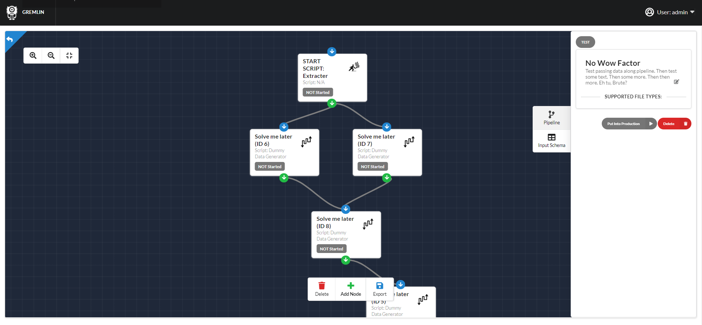
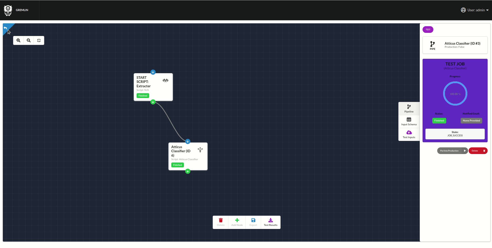
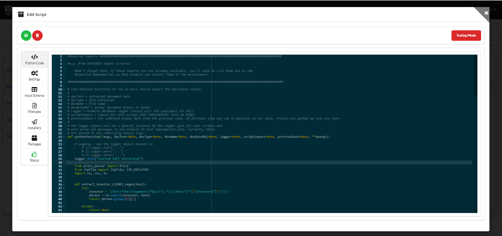

=============
GREMLIN AGPL
=============

-----------------------------------------------------
The open source, low-code legal engineering platform.
-----------------------------------------------------

.. image:: https://img.shields.io/badge/built%20with-Cookiecutter%20Django-ff69b4.svg
     :target: https://github.com/pydanny/cookiecutter-django/
     :alt: Built with Cookiecutter Django
.. image:: https://img.shields.io/badge/code%20style-black-000000.svg
     :target: https://github.com/ambv/black
     :alt: Black code style

:License: AGPL

Overview
--------

Gremlin is designed for building and deploying text transformation pipelines. Documents go in,
text is extracted, and then the text and source documents are automatically passed into Python
scripts that you write. Any data or files you return from your script is automatically packaged
up and returned upon the completion of execution. You can mix and match scripts and build complex
pipelines of scripts, letting you combine tested building blocks of logic to achieve more complex
tasks.

Features
--------

Visual Document / Text Processing Pipeline Editor
~~~~~~~~~~~~~~~~~~~~~~~~~~~~~~~~~~~~~~~~~~~~~~~~~

Built-in Python Editor
~~~~~~~~~~~~~~~~~~~~~~~~~~~~~~~~~~~~~~~~~~

Wizard View for Easy Deployment to End-Users
~~~~~~~~~~~~~~~~~~~~~~~~~~~~~~~~~~~~~~~~~~~~

.. figure:: docs/images/LawyerInterface.gif

Example Use-Cases
-----------------

Transformer-Powered Contract Analysis
~~~~~~~~~~~~~~~~~~~~~~~~~~~~~~~~~~~~~

.. figure:: docs/images/AtticusClassifier.gif

MORE TO COME (see samples folder for sample, importable Gremlin pipelines)
~~~~~~~~~~~~~~~~~~~~~~~~~~~~~~~~~~~~~~~~~~~~~~~~~~~~~~~~~~~~~~~~~~~~~~~~~~

Installation
------------

**The easiest way to install the Gremlin beta is via Docker-Compose. Ideally we can build some one-click installers for
1.0 release.**

- Requirements
    - Docker
    - Docker-Compose

- Optional Requirements
    - **Amazon AWS S3 Bucket** - This is optional in theory, though I've not tested the system storing files locally.
      This won't be scalable, however.
    - **SendGrid API Key** - If you want to enable password recovery, username recovery email updates and other features
      that depend on sending e-mails, you'll need a SendGrid API key.

- Install Prerequisites (Assuming Ubuntu 18.04)
    - First, setup Docker:
        - I recommend you follow Digital Ocean's excellent instructions at https://www.digitalocean.com/community/tutorials/how-to-install-and-use-docker-on-ubuntu-18-04
    - Next, setup Docker Compose:
        - Again, highly recommended you follow the Digital Ocean walkthrough here: https://www.digitalocean.com/community/tutorials/how-to-install-docker-compose-on-ubuntu-18-04

- Gremlin Installation steps
    - In your terminal, cd to the directory you'd like to run Gremlin from. For example, perhaps a source subdirectory in your user home::

        cd ~/source

    - Clone the latest version of the GremlinServer repository::

        git clone https://github.com/JSv4/GremlinServer

    - cd into the repository directory and create a .envs folder::

        cd EXAMPLE
        sudo mkdir .envs
        cd .envs

    - For production deploys (if you call docker-compose using production.yml):
        - You'll want to have a .production subdirectory::

            mkdir .production
            cd .production

        - Then you'll need two .env environment files, one for django and one for postgres. Sample files are provided in
          the /samples/envs/production folder of this repository. You will need to replace the values in brackets [ ].
          In the command line, you could copy these samples and then edit them using the following commands::

            cp ../../samples/envs/production/django.env .django
            nano .django
            cp ../../samples/envs/production/postgres.env .postgres
            nano .postgres

    - For running the server locally or development, you'll be calling docker-compose using local.yml and need to use local .env files.
        - You need to create a .local subdirectory in the .envs folder. From the .envs folder::

            mkdir .local
            cd .local

        - Then, you need a .django .env file containing system env variables for Django and a .postgres .env file containing env variables for postgres.
          We recommend you start with the sample env files provided in the /samples/envs/local folder of this respository.
          You will need to replace the values in brackets [] with the values in your env. To copy the samples and open them
          for editing, please enter the following commands::

            cp ../../samples/envs/local/django.env .django
            nano .django
            cp ../../samples/envs/local/postgres.env .postgres
            nano .postgres

- Docker-Compose Install - now, return to the main Gremlin directory::

        cd ../..

- Now, build Gremlin
    - For Production deploys::

        docker-compose -f production.yml build

    - For local deploys::

        docker-compose -f local.yml build

- Now, run any migrations::
    - For production::

        docker-compose -f production.yml run --rm django python manage.py makemigrations
        docker-compose -f production.yml run --rm django python manage.py migrate

    - For local deploy::

        docker-compose -f local.yml run --rm django python manage.py makemigrations
        docker-compose -f local.yml run --rm django python manage.py migrate

- Create an admin / superuser account by typing the command below and following the prompts:
    - For production::

        docker-compose -f production.yml run --rm django python manage.py createsuperuser

    - For local::

        docker-compose -f local.yml run --rm django python manage.py createsuperuser

- Now launch GREMLIN:
    - Production::

        docker-compose -f production.yml up

    - Local::

        docker-compose -f local.yml up

Interacting with GremlinServer
------------------------------

At the moment, the documentation for the API is admittedly sparse. We recommend that you separately install and run GremlinGUI
for a modern, REACT-based way to access and use GremlinServer. You can use the GremlinServer directly, however, though we don't
recommend it except for people who are already familiar with Django and have a working familiarity with GremlinServer.

- You should see a splash page at the server url root. For local deploys, this will be http://localhost/
- To visit the API, go to your server url /api. For local deploys, this will be http://localhost:8000/api
- To visit the DJANGO-admin dashboard, go to your server url /admin. For local deploys this will be http://localhost:8000/admin
    - From the Django admin, you can actually use all of the functionality of Gremlin, however it will not be an intuitive
      experience. IF, however, you find that you run into an error with GremlinGUI that you can't resolve, such as an issue
      installing a script, running a job, etc. that you can't fix from the GremlinGUI, you can always fallback to here
      and edit or delete any object on the system. Be extremely careful, however. Deleting objects like Pipelines or Scripts
      will delete associated results and cannot be recovered.

Pipeline & Node Schemas
-----------------------

GREMLIN currently supports checking user-provided inputs against
a pre-set "schema" defined with JSON-schema. This is currently a very
technical approach, *however* it will not be much work to use the JSON
schema spec to render input forms for the end-user and show these in the
"lawyer" GUI. It wouldn't be that challenging to create (or perhaps borrow,
if a suitable library / project exists) a visual editor to let engineers
build a questionnaire / input form which would then get stored as a json schema.
For now, however, IF you provide a schema (and you don't have to), you need to
code it yourself and understand json schema.

Pipelines & Nodes Data Outputs and Access in Pipeline
-----------------------------------------------------

Each node in the document processing pipeline has a start and end state. This state contains
the data that goes into the node and then is produced by it. This lets you access previous node
outputs at any subsequent node in the pipeline. The node state object looks like this::

    {
        current_node: {
            id: INT,
            this_node_result_id: id (INT),
            this_node_doc_result_ids: [doc_result_id1 (INT), doc_result_id2 (INT), doc_result_id3 (INT)],
            parent_node_ids: [ids..]
        },
        node_results: {
            node_id (INT): {
                doc_results: [doc_result_id1 (INT), doc_result_id2 (INT), doc_result_id3 (INT)],
                node_result_data: {json obj stored in STEP type result}
            },
            node_result_id (INT): ...
        },
        doc_results: {
            result_id (INT): {
                doc_id: id (INT),
                node_id: id (INT),
                data: {json obj stored in DOC type result},
            },
            doc_result_id (INT): {
                node_id: id (INT),
                data: json obj stored in DOC type result},
            }
            ...
        }
    }

Gremlin will pass the state from the last node to the next node as the "previousData" argument. It will automatically
update this state object with output data of the current node upon completion. This state will be a) stored to DB, b)
stored in the return output zip and c) passed to subsequent nodes (if applicable).

Inputs Available in Your Scripts
--------------------------------

Depending on which type of script you've setup, your script will return one of two sets of named arguments:

#. **RUN_ON_JOB** - For scripts meant to run once per job, Gremlin will pass your script the following args::

    job=job,
    step=node,
    logger=scriptLogger,
    nodeInputs=node_inputs,
    jobInputs=job_inputs,
    previousData=transformed_data,
    dataZip=data_zip_obj

#. **RUN_ON_JOB_DOC** - For scripts meant to run once per job, Gremlin will pass your script the following args::

    docType=doc.type,
    docText=doc.rawText,
    docName=doc.name,
    docByteObj=docBytes,
    nodeInputs=node_result.node_inputs,
    jobInputs=node_result.job_inputs,
    previousData=transformed_data,
    dataZip=data_zip_obj,
    logger=scriptLogger,

Returning Data from Your Script
-------------------------------

You have a few different options to return data to the user depending on the type of script:

#. **RUN_ON_JOB** - For scripts meant to run once per job, Gremlin expects the the following return statement::

    return finished, message, data, file_bytes, file_name, doc_packaging

  #. *finished* - should be a boolean which indicates script completed successfully or unsuccessfully.
  #. *message* - string you can pass back indicating job status messages.
  #. *data* - a dict that Gremlin will package up and return (as well as pass to subsequent nodes).
  #. *file_bytes* - you tell gremlin to write a file to the resulting zip that will be given back to the user. Pass file bytes
     back via this parameter (can also be a string if this is a txt file). Return None for no file.
  #. *file_name* - if you are passing file_bytes back, make sure to pass a file_name string back as well.
  #. *doc_packaging* - In lieu of giving Gremlin a file to package by passing file_bytes, you can instruct Gremlin to package up
     the job documents in a certain folder structure inside of a zip. You might want to do this, for example, if you want
     to sort or filter documents. For example, you might want to have two folders of docs, one for docs containing a given
     provision and one for docs not containing it. Or you might want to cluster documents by some trait. The doc_packaging
     variable should be a dictionary mapping document ids to the file path you want the document to have inside of a zip
     file to be return to the user. So, taking the two examples we just discussed, the doc_packaging dict might look like this:

       #. *clustering example*::

           doc_packaging = {
               1: '/Clusters/Cluster 1/',
               2: '/Clusters/Cluster 2/',
               3: '/Clusters/Cluster 1/',
               4: '/Clusters/Cluster 1/'
           }

       #. *sorting docs by clause presence*::

           doc_packaging = {
               1: '/Early Termination/',
               2: '/Early Termination/',
               3: '/Early Termination/',
               4: '/No Early Termination/'
           }

     **You do not need to return a doc_packaging dictionary, BUT, if you do, make sure to pass a file_name for the resulting
     zip.**

#. **RUN_ON_JOB_DOC** - For scripts meant to run once per doc per job, Gremlin expects the the following return statement::

    return finished, message, data, file_bytes, file_name

  #. *finished* - should be a boolean which indicates script completed successfully or unsuccessfully.
  #. *message* - string you can pass back indicating job status messages.
  #. *data* - a dict that Gremlin will package up and return (as well as pass to subsequent nodes).
  #. *file_bytes* - you tell gremlin to write a file to the resulting zip that will be given back to the user. Pass file bytes
     back via this parameter (can also be a string if this is a txt file). Return None for no file.
  #. *file_name* - if you are passing file_bytes back, make sure to pass a file_name string back as well.

Pipeline Architecture
---------------------

NOTE: Improved documentation for the pipeline architecture is coming. This current documentation is meant to describe how
Gremlin assembles scripts into a sequence of celery tasks that are then executed by celery workers. Look in Jobs/tasks/tasks.py
for the code behind the task types described below. There are other helper functions and constants in Jobs/tasks/task_helpers.py

#. When a user requests that a Job run, GremlinServer launches the runJob() task. This looks at the pipeline model associated
   with that job. It will then look at the root_node field to try to find the root node. Nodes map PythonScripts to pipelines.
   A script can be shared across multiple pipelines because, to include it in a pipeline, GremlinGUI creates a new Node to
   link the script to the selected pipeline. The pipeline has a field root_node which points to the first script to run.
   For now, this root node is ALWAYS Gremlin's Tika-powered extract task. This may change in the future so that you can specify
   your own root node.

#. The runJob task asynchronously calls a recursive method buildNodePipelineRecursively(pipeline, start_node), Gremlin
   traverses the specified pipeline from the specified root to build a sequential, in-order list of nodes that must be run
   for this job. This is probably leaving some performance on the table as the pipeline nodes always runs in order.

   #. Certain nodes run in parallel over all docs BUT execution completes and Gremlin then takes the next node and runs that.
      so the directed graph structure of the pipeline is flattened into a linear list of nodes to run, one after another.

      #. I'd like to add a feature to provide for faster, greedy execution so we don't have to wait for nodes that are siblings
         to complete - e.g. if we have a parent node that feeds three children nodes, currently, becomes four, sequential steps.
         The parent node runs first and then its children run one after another. There's no reason we can't have the parent
         trigger the children and then have Gremlin run each child simultaneously so long as there are free workers.

      #. Another thing to be aware of here is if pipelines change, Gremlin determines the pipeline at run-time, so you could
         conceivably create two jobs with identical inputs at the same time and specify they run on the "same" pipeline.
         If they are started at different times, however, and the pipeline, nodes or scripts change in between, these two
         "identical" jobs could produce different results. For now, *DON'T change pipelines or scripts in production*
         or, if you need to audit results or something like that, make sure you are backing up your tasks. In the future,
         some kind of version control might be possible for the scripts, however the soon-to-be-added ability to install
         python packages from wheels and provide data files will make this challenging to completely and seamlessly
         handle (for example, if you have a 1 GB data file and update it a bunch of times, should be burn multiple gigs
         saving those versions? It could get quite complex).

   #. The runJob task then iterates over the list of sequential nodes that need to be run, depending upon the node type,
      runJob will assemble one of three different Celery workflows and then add them to a queue of tasks for execution.

      #. **ROOT_NODE** - Root nodes have the following celery task structure

         - Task createSharedResultForParallelExecution which creates a task object that will be accessed by workers
           working on the docs.
         - CELERY chord comprised of:

           - CELERY group comprised of an extractTextForDoc task for each Doc in this job.
           - CELERY TASK resultsMerge, which terminates that chord.

      #. **THROUGH_SCRIPT** - For the moment, this *is* any node that's not a root node. In the future you could imagine
         there being more types of nodes. Depending on whether this node is meant to execute its script over each doc in
         parallel or simply process all data in the pipeline up to that point in series, Gremlin will put together two
         different celery workflows.

         - **If Node's Script is of type RUN_ON_JOB_ALL_DOCS_PARALLEL**, the following sequence of CELERY tasks is added
           to the list of celery tasks which we'll ultimately tell Celery to run:

           - Task createSharedResultForParallelExecution which creates a task object that will be accessed by workers
             working on the docs.
           - CELERY chord comprised of:

             - CELERY group comprised of applyPythonScriptToJobDoc.s(docId, jobId, nodeId, scriptId) for each Doc in this
               job. This task will load user Python script from the database and apply ot to the current pipeline data and
               document.
             - CELERY TASK resultsMerge, which terminates the chord, collects all of the resulting data and adds it to the
               appropriate Result obj.

         - **If Node's Script is of type RUN_ON_JOB**:

           - Add task applyPythonScriptToJob.s(jobId, nodeId, scriptId), which will provide the script with all pipeline
             data to this point in execution but NOT the docs.

      # Next a "packaging" task called packageJobResults.s(jobId) is added to the chain of tasks. This is currently hardcoded
        and will package all of the files and data produced by the pipeline. You can pass specific packaging instructions
        from a script to the pipeline to have some control over this process. Documentation and syntax for this is currently
        evolving, so we recommend you ignore this capability for now.

      # Finally, Gremlin appends a final task called stopPipeline.s(jobId) that will look at data and errors that passed
        through the pipeline and stop the job, storing the appropriate results and error messages in the database.

Further Guidance
----------------

See detailed `cookiecutter-django Docker documentation`_.

.. _`cookiecutter-django Docker documentation`: http://cookiecutter-django.readthedocs.io/en/latest/deployment-with-docker.html

Licenses and Attributions
-------------------------

- Icons

  - `Monster`_ - By iconcheese (`CC BY 3.0`_)
  - `Starting Flags`_ - By Xela Ub, VN (`CC BY 3.0`_)
  - `Step Arrows`_ - BY luca fruzza, IT (`CC BY 3.0`_)
  - `Split Arrows`_ - By Hea Poh Lin, MY (`CC BY 3.0`_)
  - `Nodes Icon`_ - By Gregor Cresnar (`CC BY 3.0`_)

- Software Libraries

  - React-Diagrams
  - Django
  - Django Rest Framework
  - Celery

.. _Monster: https://thenounproject.com/search/?q=monster&i=2235987
.. _Starting Flags: https://thenounproject.com/search/?q=start+flag&i=314735
.. _CC BY 3.0: https://creativecommons.org/licenses/by/3.0/
.. _Step Arrows: https://thenounproject.com/search/?q=steps&i=1677173
.. _Split Arrows: https://thenounproject.com/search/?q=many+arrows&i=498877
.. _Nodes Icon: https://thenounproject.com/search/?q=node&i=159043
